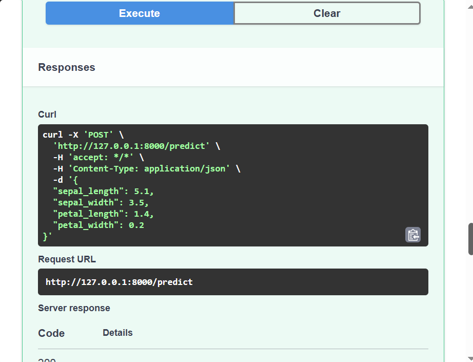

# Iris Flower Classification API

A REST API built with **FastAPI** that serves a trained scikit-learn model. Send the measurements of an Iris flower and the API returns the predicted species and the model's confidence.

## Model

| Item | Details |
|------|---------|
| Dataset | Iris dataset (built into scikit-learn, 150 samples, 3 classes) |
| Task | Multi-class classification |
| Pipeline | `StandardScaler` → `LogisticRegression` |
| Predicts | Species: `setosa`, `versicolor` or `virginica` |
| Test accuracy | ~93% (80/20 stratified split) |

The scaler and model are saved together in `model/pipeline.pkl`, so data sent to the API is preprocessed exactly like the training data.

## Input Features

| Field | Type | Description |
|-------|------|-------------|
| `sepal_length` | float (> 0) | Sepal length in cm |
| `sepal_width` | float (> 0) | Sepal width in cm |
| `petal_length` | float (> 0) | Petal length in cm |
| `petal_width` | float (> 0) | Petal width in cm |

## API Endpoints

| Method | Endpoint | Description |
|--------|----------|-------------|
| GET | `/` | API name and short description |
| GET | `/health` | Health check, returns `{"status": "ok"}` |
| POST | `/predict` | Returns predicted species and probabilities |

## Project Structure

```
iris-api/
├── main.py            # FastAPI application
├── save_model.py      # Trains and saves the model
├── test_api.py        # Client script that sends requests to the API
├── model/
│   └── pipeline.pkl   # Saved preprocessing + model pipeline
├── screenshots/
│   └── swagger_ui.png # Swagger UI screenshot
├── requirements.txt
└── README.md
```

## Installation

```bash
git clone https://github.com/faridhasan2020/Project-05/iris-api.git
cd iris-api

# Create and activate a virtual environment
python -m venv venv
# Windows:
venv\Scripts\activate
# macOS / Linux:
source venv/bin/activate

pip install -r requirements.txt
```

## Train the Model

```bash
python save_model.py
```

This creates `model/pipeline.pkl`.

## Run the API

```bash
fastapi dev main.py
```

- API: http://localhost:8000
- Swagger UI: http://localhost:8000/docs

## Test the API

With the server running, open a second terminal and run:

```bash
python test_api.py
```

## Example Request and Response

**Request:** `POST /predict`

```json
{
  "sepal_length": 6.9,
  "sepal_width": 3.1,
  "petal_length": 5.4,
  "petal_width": 2.1
}
```

**Response:**

```json
{
  "prediction": "virginica",
  "probability": 0.9173,
  "all_probabilities": {
    "setosa": 0.0001,
    "versicolor": 0.0825,
    "virginica": 0.9173
  }
}
```

Using curl:

```bash
curl -X POST http://localhost:8000/predict \
  -H "Content-Type: application/json" \
  -d '{"sepal_length": 6.9, "sepal_width": 3.1, "petal_length": 5.4, "petal_width": 2.1}'
```

## Swagger UI


